<h3>Automated CI/CD pipeline to build, scan, and deploy a containerized FastAPI application on Kubernetes with full observability.</h3>

<h4>📌 Project Overview</h4>
This project demonstrates a real-world DevOps workflow, implementing a fully automated pipeline from code commit to deployment and monitoring.
It integrates CI/CD automation, containerization, Kubernetes orchestration, security scanning, and observability, closely resembling a production environment setup.

<h4>📸 Demo</h4>

  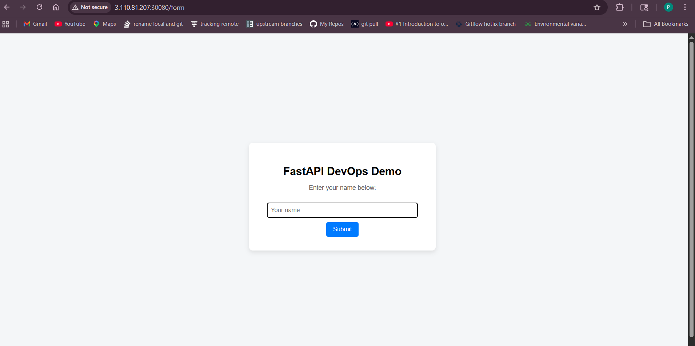 
  FastAPI application successfully deployed and accessible via Kubernetes service
    

  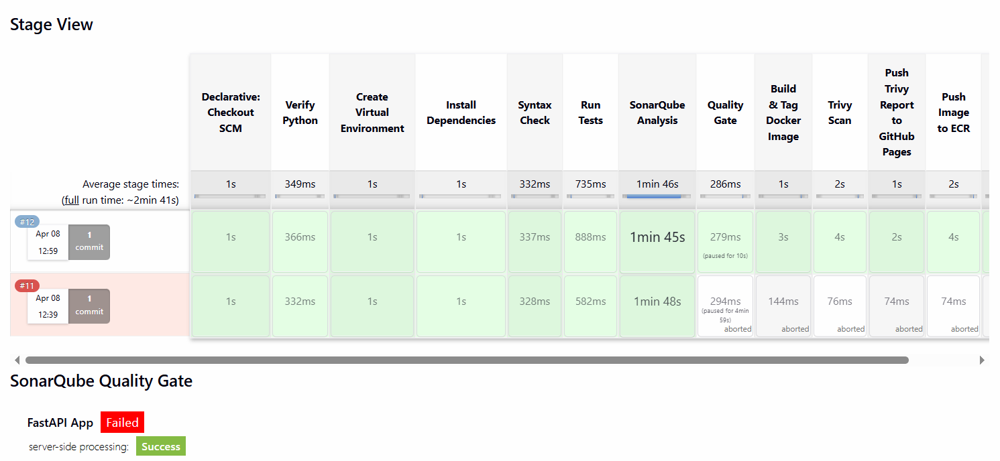 
  CI/CD pipeline showcasing build, security scan, and Kubernetes deployment stages
    

  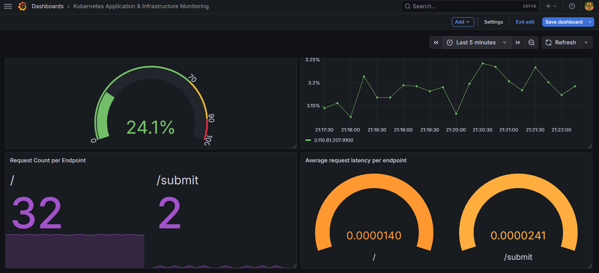 
  Grafana dashboard visualizing real-time system and application metrics
    

<h4>🏗️ Architecture</h4>
<h4>⚙️ Tech Stack</h4>
<table>
  <thead>
    <tr>
      <th>Category</th>
      <th>Tools Used</th>
    </tr>
  </thead>
  <tbody>
    <tr>
      <td>CI/CD</td>
      <td>Jenkins</td>
    </tr>
    <tr>
      <td>Containerization</td>
      <td>Docker</td>
    </tr>
    <tr>
      <td>Orchestration</td>
      <td>Kubernetes (kOps on AWS)</td>
    </tr>
    <tr>
      <td>Image Registry</td>
      <td>AWS ECR</td>
    </tr>
    <tr>
      <td>Monitoring</td>
      <td>Prometheus, Grafana</td>
    </tr>
    <tr>
      <td>Security</td>
      <td>Trivy</td>
    </tr>
    <tr>
      <td>Code Quality</td>
      <td>SonarQube</td>
    </tr>
    <tr>
      <td>Backend</td>
      <td>FastAPI</td>
    </tr>
  </tbody>
</table>

<h4>⚙️ CI Server Setup (Jenkins)</h4>

Configured a dedicated CI server with required tools and permissions 

  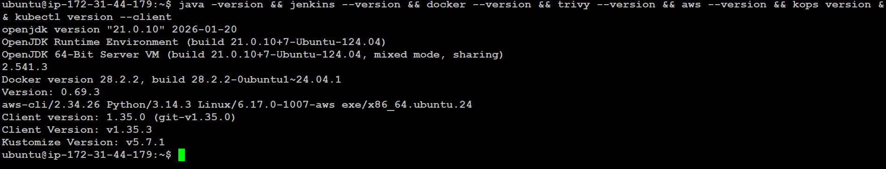 
  Installed tools
    

  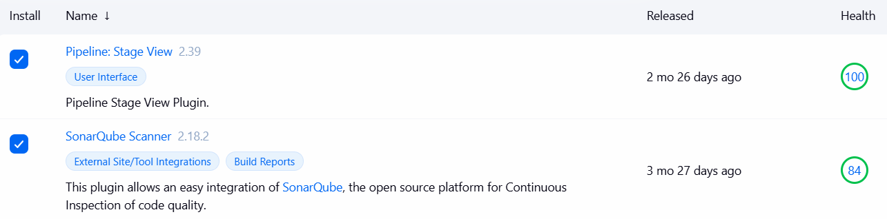 
  Jenkins Plugins
    

  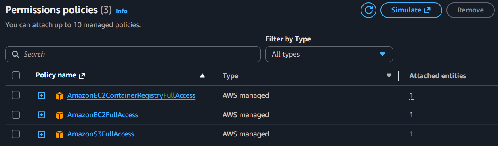 
  Custom IAM Role attached to CI Server
    

  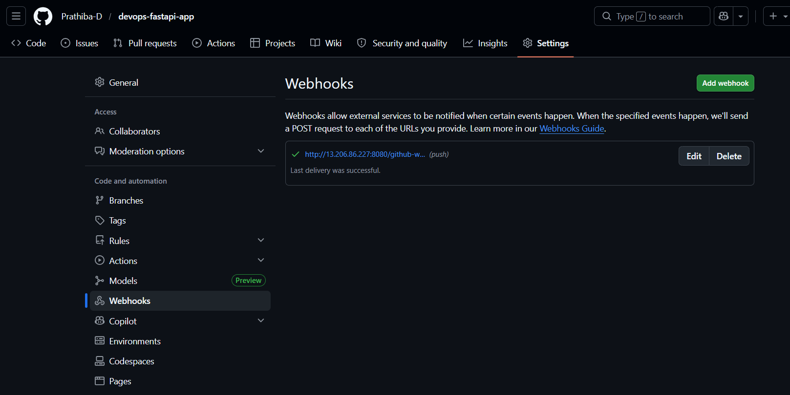 
  GitHub Webhook Integration
    

<h4>🏗️ Infrastructure Setup (AWS + kOps)</h4>
Provisioned a Kubernetes cluster using kOps with AWS as the cloud provider 

  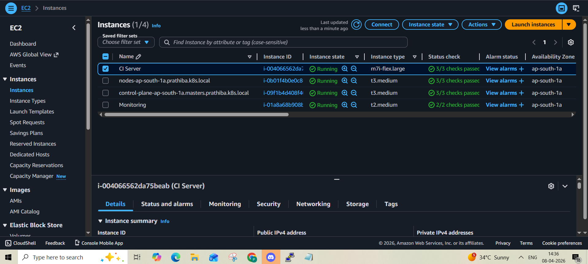 
  EC2 Instances
    

  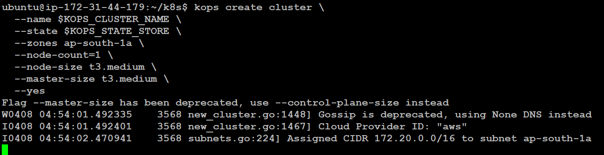 
  KOPS Cluster
    

<h4>🔄 CI/CD Pipeline</h4>

Fully automated pipeline triggered on code changes
 

   
  Pipeline Execution Flow
    

  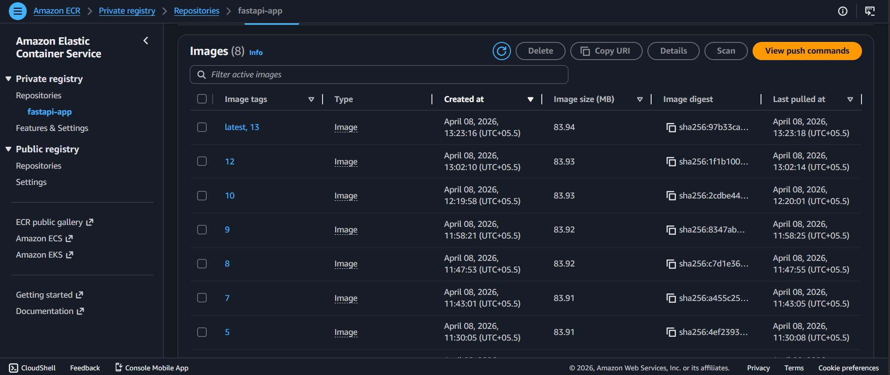 
  AWS ECR Repository
    

<h4>Pipeline Stages</h4>
<ol>
  <li>Code pushed to GitHub</li>
  <li>Jenkins pipeline triggered via webhook</li>
  <li>Code quality analysis (SonarQube)</li>
  <li>Docker image built</li>
  <li>Security scan (Trivy)</li>
  <li>Image pushed to AWS ECR</li>
  <li>Deployment to Kubernetes</li>
</ol>

<h4>🔐 Code Quality & Security</h4>

Integrated quality checks and vulnerability scanning into CI pipeline
 

  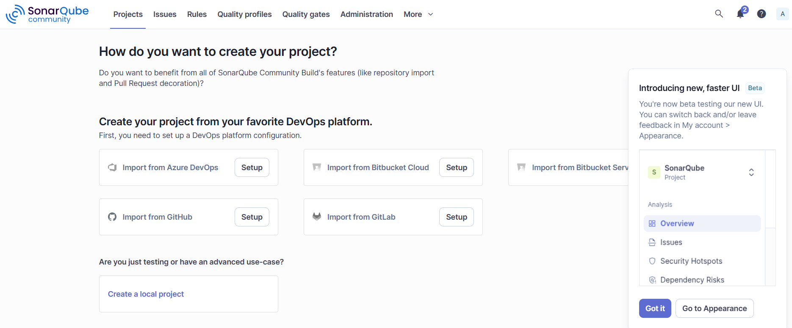 
  SonarQube Analysis
    

  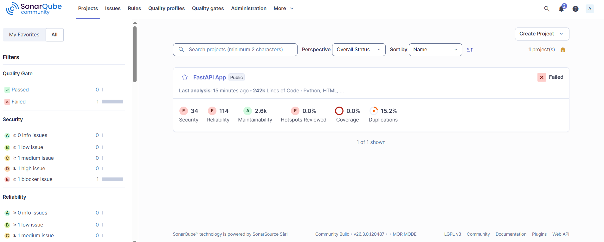 
  Quality Gate Status
    

  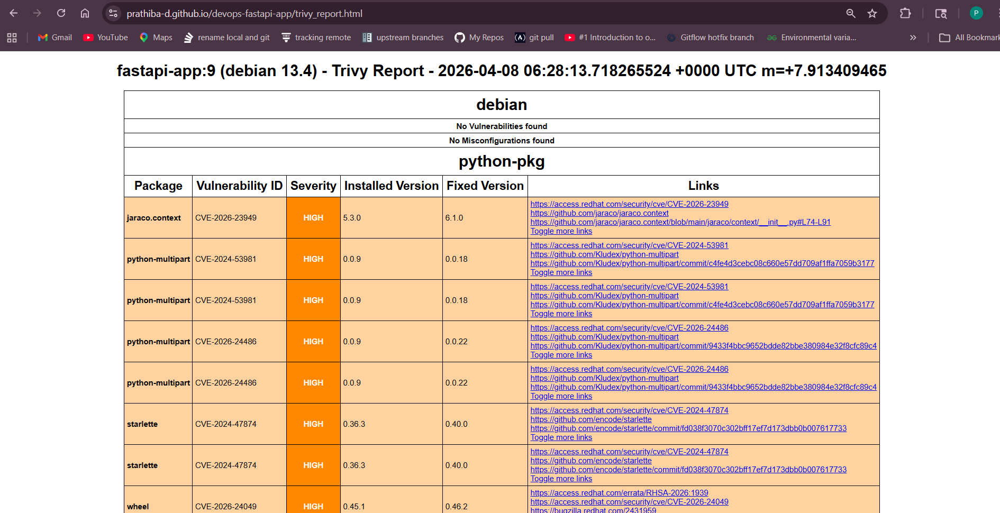 
  Trivy Vulnerability Scan
  Report is live <a href="https://prathiba-d.github.io/devops-fastapi-app/">here</a>
    

<h4>☸️ Kubernetes Deployment</h4>

Deployed application using Kubernetes with zero-downtime strategy
 

  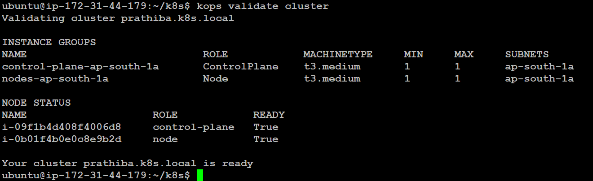 
  Cluster Nodes Status
    

  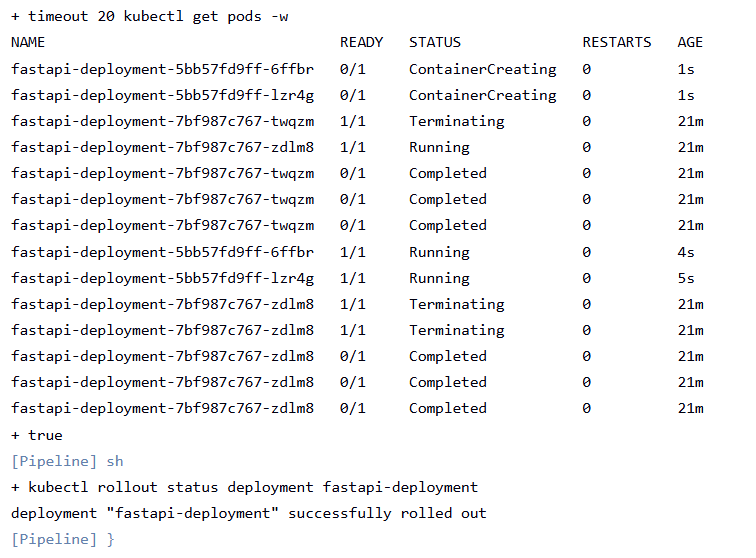 
  Rolling Update Strategy
    

<h4>📊 Monitoring & Observability</h4>

Implemented full-stack observability using Prometheus, Alertmanager, and Grafana for metrics collection, alerting, and visualization

  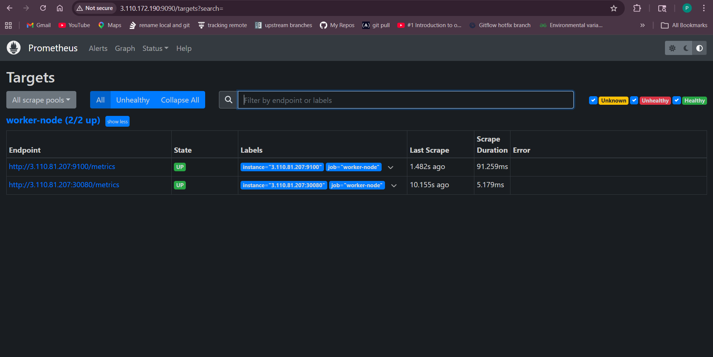 
  Prometheus Targets Up (Healthy)
    

  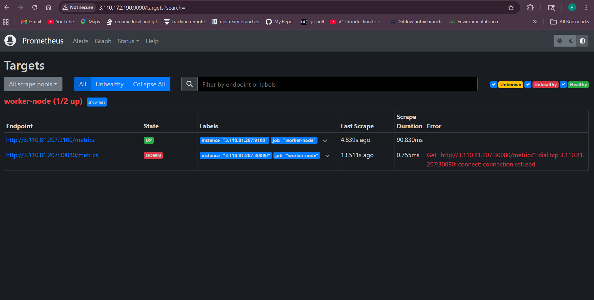 
  Prometheus Target Down (Failure Scenario)
    

  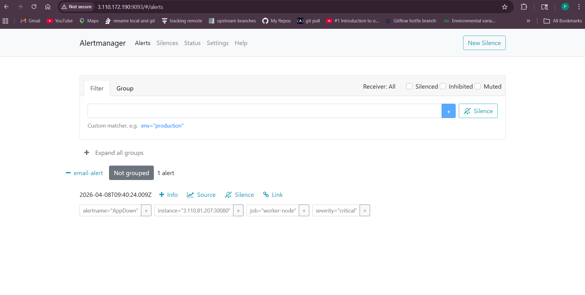 
  Active Alerts Dashboard - Alertmanager aggregating and displaying active alerts triggered by Prometheus rules
    

  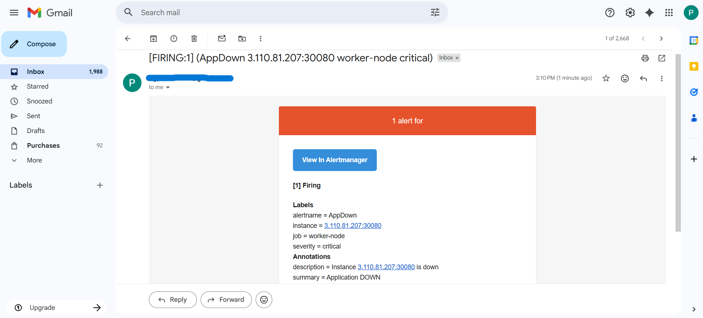 
  Automated email alerts sent based on configured alerting rules
    

  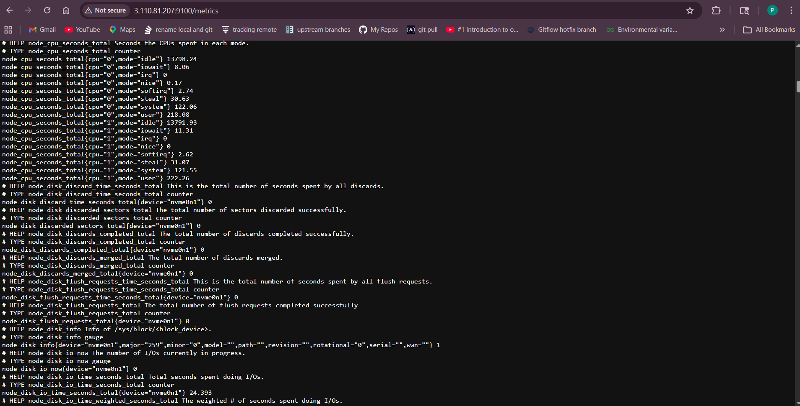 
  Node exporter - System-level metrics including CPU, memory, and resource utilization
    

  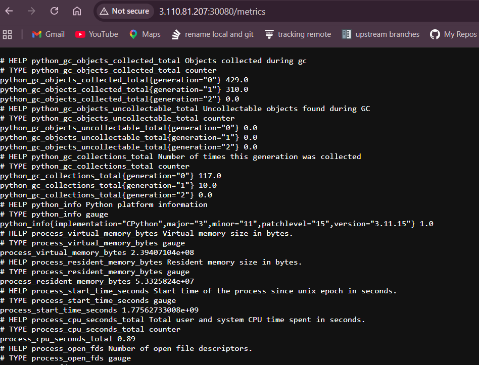 
  Application-level metrics exposed via FastAPI and scraped by Prometheus
    

<h4>📂 Project Structure</h4>
<pre>
devops-fastapi-app/
│── main.py                  # FastAPI application source code
│── Dockerfile               # Container build definition
│── Jenkinsfile              # CI/CD pipeline configuration
│── k8s/                     # Kubernetes manifests (Deployment, Service)
│── monitoring/              # Prometheus & Alertmanager configs
│── images/                  # Screenshots used in README.md
│── README.md                # Project documentation
</pre>
<pre>
<h4>💡 Key Highlights</h4>
✅ Automated CI/CD pipeline from code commit to deployment using Jenkins  
✅ Deployed a production-like Kubernetes cluster using kOps on AWS  
✅ Implemented container security scanning using Trivy  
✅ Enforced code quality gates with SonarQube  
✅ Achieved zero-downtime deployments using Kubernetes rolling updates  
✅ Enabled full system observability with Prometheus & Grafana dashboards
</pre>

<h4>🎯 What This Project Demonstrates</h4>
<ul>
  <li>Strong understanding of DevOps principles and workflows</li>
  <li>Hands-on experience with CI/CD automation</li>
  <li>Hands-on experience with containerization & orchestration</li>
  <li>Hands-on experience with infrastructure provisioning</li>
  <li>Hands-on experience with monitoring & alerting systems</li>
  <li>Ability to build production-ready, scalable systems</li>
</ul>
